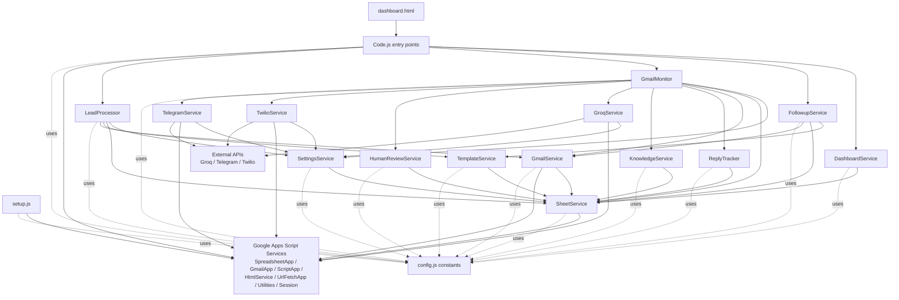

# Dependency Diagram

This document shows which services call which other services in the current Apps Script project.

## Service Call Diagram

## Service-to-Service Adjacency List

### Entry points

- `Code.js` -> `DashboardService`, `FollowupService`, `GmailMonitor`, `LeadProcessor`
- `dashboard.html` -> `Code.js` server functions through `google.script.run`
- `setup.js` -> Google Apps Script spreadsheet APIs

### Core workflow services

- `LeadProcessor` -> `SettingsService`, `SheetService`, `TemplateService`, `GmailService`
- `GmailMonitor` -> `SettingsService`, `SheetService`, `GmailService`, `ReplyTracker`, `KnowledgeService`, `GroqService`, `HumanReviewService`, `TwilioService`, `TelegramService`
- `FollowupService` -> `TemplateService`, `SheetService`, `GmailService`
- `DashboardService` -> `SheetService`

### Integration services

- `GmailService` -> `SheetService`, Google Apps Script Gmail/utility services
- `GroqService` -> `SettingsService`, `UrlFetchApp`, Groq API
- `TelegramService` -> `SettingsService`, `UrlFetchApp`, Telegram Bot API
- `TwilioService` -> `SettingsService`, `UrlFetchApp`, Twilio API

### Spreadsheet-backed utility services

- `SettingsService` -> `SheetService`
- `TemplateService` -> `SheetService`
- `KnowledgeService` -> `SheetService`
- `ReplyTracker` -> `SheetService`
- `HumanReviewService` -> `SheetService`

### Shared base layer

- `SheetService` -> Google Apps Script spreadsheet APIs
- `config.js` supplies constants to nearly every service

## Most Central Service

`GmailMonitor` is the main orchestration hub. It has the highest coupling and coordinates:

- Gmail thread reads
- knowledge lookup
- AI analysis
- AI logging
- lead status updates
- duplicate reply tracking
- escalation to human review
- external notifications

If you want to refactor the project later, `GmailMonitor` is the best first target to split into smaller workflow components.
